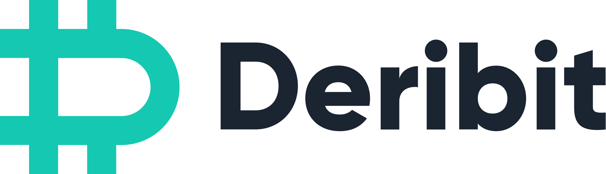

<picture>
    <source media="(prefers-color-scheme: light)" srcset="https://github.com/andrews-lerk/aio-deribit/blob/dev/docs/logo/deribit-dark.png?raw=true">
    <source media="(prefers-color-scheme: dark)" srcset="https://github.com/andrews-lerk/aio-deribit/blob/dev/docs/logo/deribit-light.png?raw=true">
    
</picture>

# Deribit asynchronous python WSS and HTTP client

### Features

- Deribit API version 2.0 -  https://docs.deribit.com/
- Full async
- Full WSS and HTTP API support
- 3 supported authentication methods (**OAuth2.0**, **Deribit signature credentials**, **Basic user credentials**)
